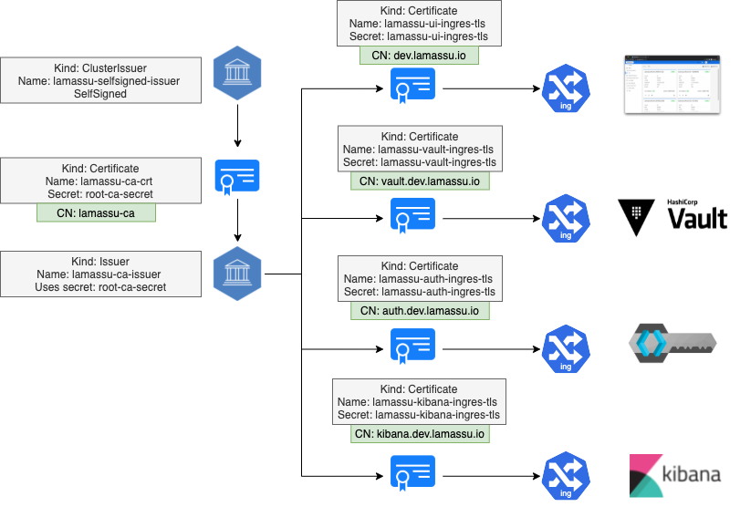
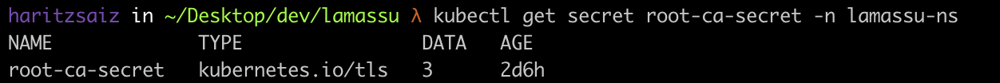
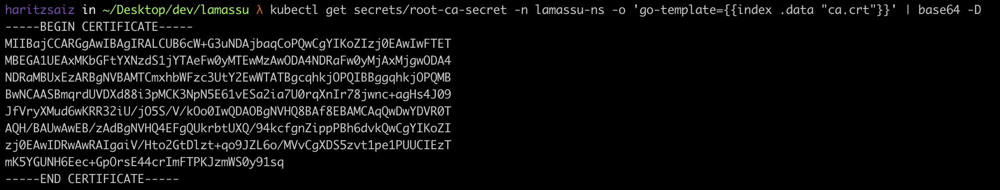
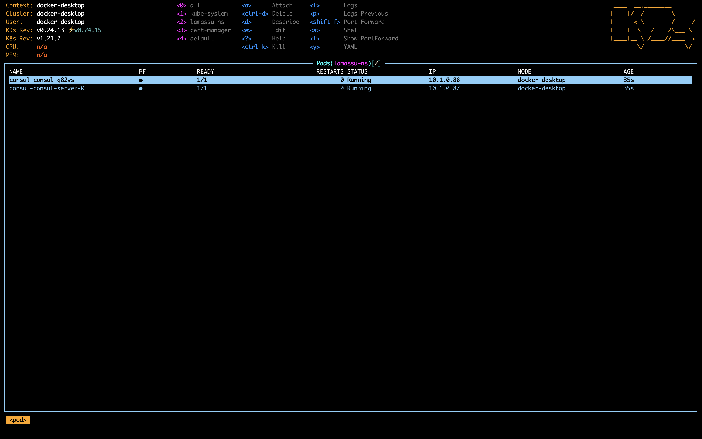
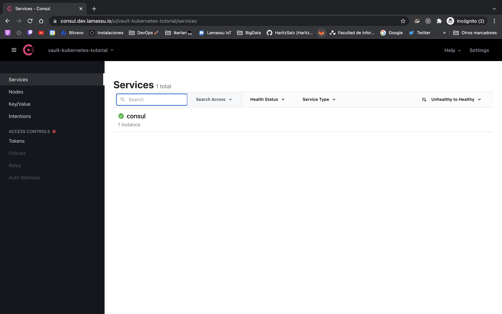
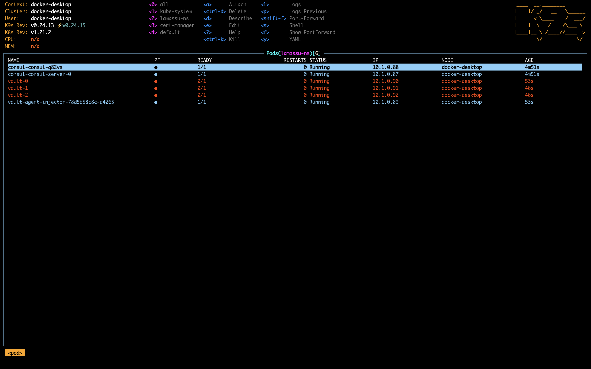
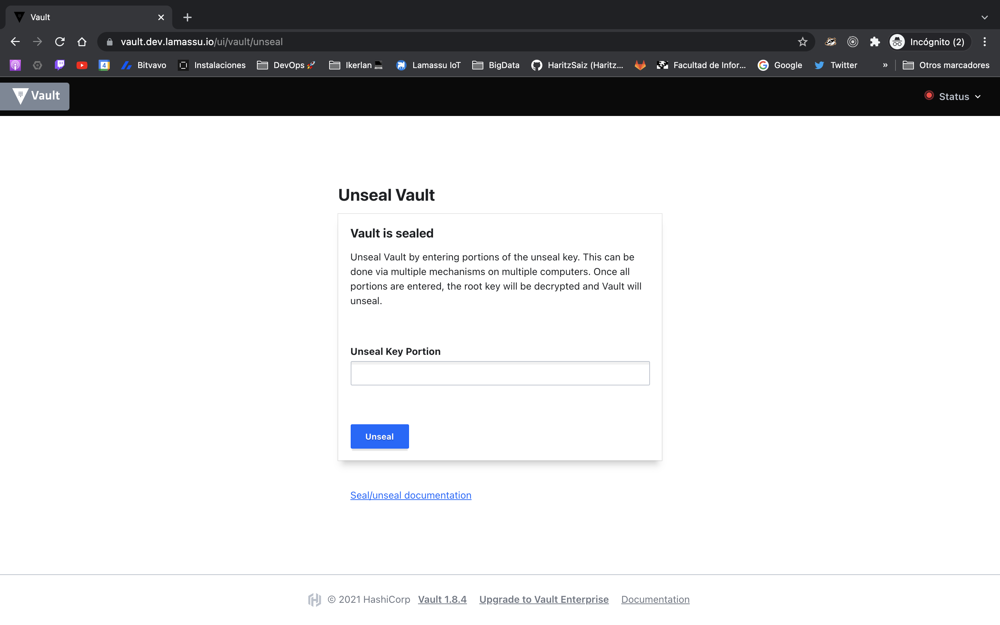

# Lamassu for Kubernetes

The aim of this repository is to help during of Lamassu in a prodcution envrionment and to provide some tips that can help troubleshoot potential erros.

## 1. Kubernetes Requirements 

In order to properly run Lamassu, make sure you have a kuebernetes cluster v1.21.2 or higher. If your cluster is managed by some cloud provider, make sure to follow the steps descrived by each kubernetes component.

This guide uses some third party tools and applications in order to succesfully deploy the application. Please make sure you have the following applications. Otherwise follow the instructions below.

### Helm v3

Helm is a tool used to manage Kubernetes applications. This tool will be used to deploy different components of Lamassus's architecture. Make sure you have this tool installed, otherwise visit Helm's website: https://helm.sh/

### Kubernetes Nginx Ingress Controller

https://kubernetes.github.io/ingress-nginx/deploy/

Kubernetes does not provide a default ingress controller. There are different alternatives that may be used, but the scripts and yaml files on this repo are based on the nginx ingress controller.


In order to install this component, run the following command:

```
kubectl apply -f https://raw.githubusercontent.com/kubernetes/ingress-nginx/controller-v1.0.4/deploy/static/provider/cloud/deploy.yaml
```

### Kubernetes Cert Manager

https://cert-manager.io/docs/

Securing the communications between applications and the end user is a top priority. Cert Manager is a convinient tool that can be used to manage the lifecycle of certificate for kubernetes resources. Follow the steps below to succesfully install the component:

```
kubectl apply -f https://github.com/jetstack/cert-manager/releases/download/v1.6.0/cert-manager.yaml
```

## 2. Deploying Lamassu

This section will guide you through the steps required to deploy Lamassu into a Kubernetes cluster

### 2.1 Generating the certificates used by kubernetes resources

As described earlier, securing traffic between components and the internet is essential. The proposed certificate structure can be seen below, but in essence, all Lamassu's applications relies on the same CA.  



Run the following scripts to create the basic resources

```
kubectl apply -f certs/selfsigned-cert-manager 
```

The following resources should've been created:

```
kubectl get secret root-ca-secret -n lamassu-ns
```


The contents of the secret are encoded in base64. For instance, to get the CA certificate, run the following command:

```
kubectl get secrets root-ca-secret -n lamassu-ns -o 'go-template={{index .data "ca.crt"}}' | base64 -D
```



### 2.2 Deploying Vault (and consul)

Vault is the core of the PKI. It's the service in charge of issuning certificates as well as storing them in a secure way. 

Hashicorp have pakced their application creating two Helm charts, one for Vault and a second one for Consul. This section describes the steps as described in the official installation process: https://learn.hashicorp.com/tutorials/vault/kubernetes-minikube?in=vault/kubernetes.

Extra resources: https://learn.hashicorp.com/tutorials/vault/kubernetes-raft-deployment-guide?in=vault/kubernetes

First add the Helm repo: 

```
helm repo add hashicorp https://helm.releases.hashicorp.com
```

Update the helm repo:

```
helm repo update
```

And finally instal Consul:

```
helm install consul hashicorp/consul
```

And finally install consul. Note that all resources are installed in the `lamassu-ns` namespace

```
helm install consul hashicorp/consul --values consul/helm-consul.yml -n lamasssu-ns
```



To access the UI using a friendly url, deploy the ingress:

```
kubectl apply -f consul/ingress.yml
```
Make sure your computer is able to reach the domain `consul.dev.lamassu.io`. Either configure a DNS server or add the following line to the `/etc/hosts` (if the kubernetes cluster is running elswere, point to one of the nodes IP):

```
consul.dev.lamassu.io  127.0.0.1
vault.dev.lamassu.io   127.0.0.1
```

Consuls's UI should be access using this URL: https://consul.dev.lamassu.io



Now it's time to install vault.

Finally install Vault using the helm charts:

```
helm install vault hashicorp/vault --values vault/helm-vault.yml -n lamassu-ns
```



As it can bee seen in the image, the pods are not fully ready. That is because vault is either sealed and has not been intialized. 

Deploy the ingress controller to access the UI:

```
kubectl apply -f vault/ingress.yml
```

Vault's UI should be accessible using this URL: https://vault.dev.lamassu.io



Let's initialize vault by running the following command:

```
kubectl exec vault-0 -n lamassu-ns -- vault operator init -key-shares=1 -key-threshold=1 -format=json > vault-cluster-keys.json
```

A file named `vault-cluster-keys.json` should be created containing the unseal keys as well as the root token. Vault has been initialized so far, but has not been unsealed yet. Run the following commands to read the unseal key to unseal vault:

```
VAULT_UNSEAL_KEY=$(cat vault-cluster-keys.json | jq -r ".unseal_keys_b64[]")
kubectl exec vault-0 -n lamassu-ns -- vault operator unseal $VAULT_UNSEAL_KEY
```

And that's it. Consul and Vault have been configured !!
## 3. Exploring Lamassu's monitoring services
